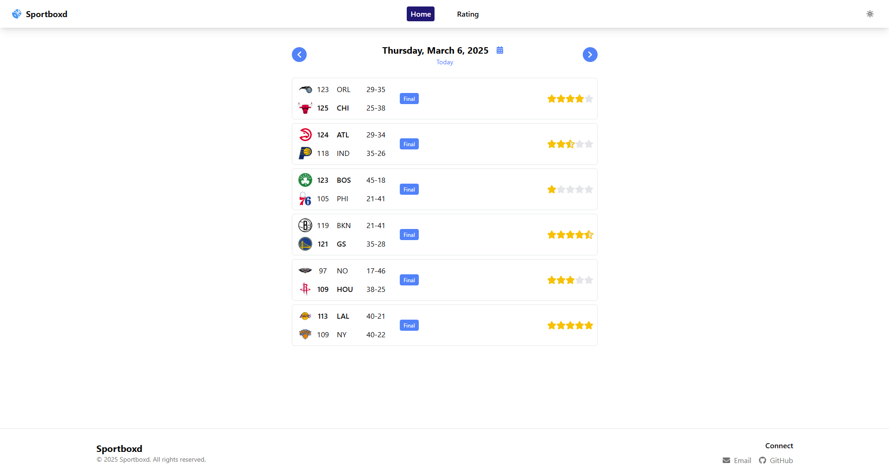
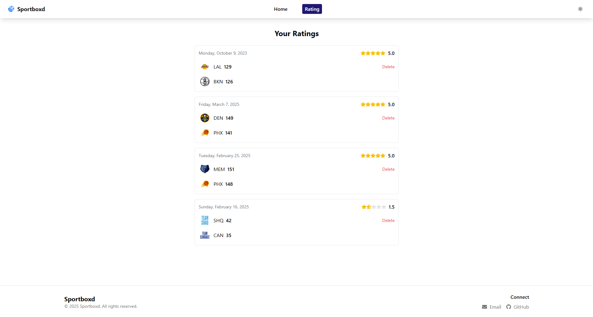
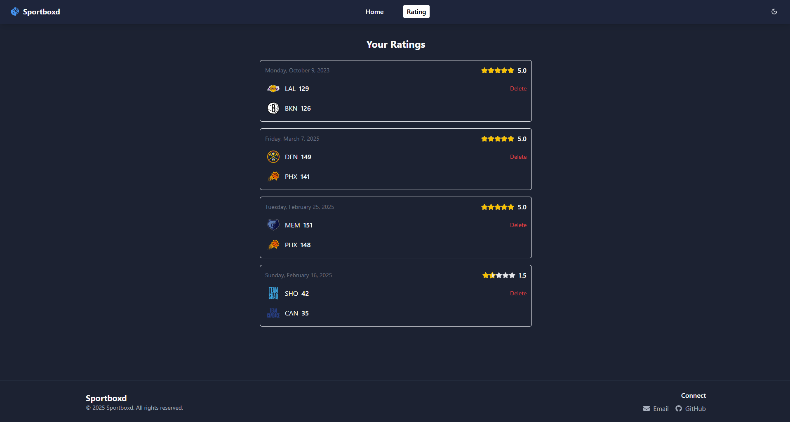

# Sportboxd

Sportboxd is a platform for sports enthusiasts to track and rate sporting events. Think of it as Letterboxd but for sports! Currently focused on NBA games, Sportboxd allows users to browse schedules, track live games, and create a personal collection of rated matches.

## 🔗 Live Demo

[Visit Sportboxd App](https://sportboxd-seven.vercel.app/)

## 📸 Screenshots

<div align="center">
  
  <p><em>Home screen showing NBA game schedule with rating capabilities</em></p>
  
  
  <p><em>Personal ratings page with user's rated games history</em></p>

  
  <p><em>Dark mode interface for comfortable viewing</em></p>
</div>

## ✨ Features

- **Daily Game Schedule**: Browse through NBA games day by day using a calendar interface
- **Live Game Tracking**: See real-time game statuses, scores, and time remaining
- **Game Ratings**: Rate games on a scale from 0.5 to 5 stars
- **Rating History**: View all your previously rated games in one place
- **Game Details**: See team records, scores, and game statuses
- **Date Navigation**: Easily move between days or jump to specific dates
- **Dark/Light Mode**: Toggle between viewing modes for comfortable browsing
- **Responsive Design**: Works on both desktop and mobile devices

> **Note:** Currently, ratings are stored locally and will be lost on page refresh. Backend persistence will be implemented in a future update.

## 🛠️ Tech Stack

### Frontend

- **React 19** with TypeScript
- **React Router 7** for navigation
- **Tailwind CSS** with custom theming
- **Shadcn UI** components for consistent design
- **React Query** for data fetching and caching
- **Context API** for state management
- **Vite** as the build tool and development server

### External APIs

- **ESPN API** for NBA game data, scores, and schedules

### Planned Backend (Coming Soon)

- Node.js with Express
- MongoDB for data storage
- User authentication system
- Social features for sharing and discussing games

## 🚀 Deployment & Hosting

The application can be deployed using any of the following services:

- **Vercel**: Recommended for easy deployment directly from GitHub
- **Netlify**: Great alternative with similar GitHub integration
- **GitHub Pages**: Simple option for static hosting

### Local Development

To run this project locally:

```bash
# Clone the repository
git clone https://github.com/alexkotov10/sportboxd.git

# Navigate to the project directory
cd sportboxd

# Install dependencies
npm install

# Start the development server
npm run dev
```

## 📄 License

This project is licensed under the **MIT License** - see the [LICENSE](LICENSE) file for details.

## 🤝 Roadmap

- [ ] Backend implementation for persistent data storage
- [ ] User authentication system
- [ ] Social features (following users, comments, etc.)
- [ ] Support for additional sports leagues
- [ ] Detailed game statistics
- [ ] Game highlights
- [ ] Game rating leaderboard

## 📬 Contact

Email: [akotov9962@gmail.com](mailto:akotov9962@gmail.com)

[GitHub Page](https://github.com/alexkotov10)

---

<div align="center">
  Made with ❤️ by Alex Kotov
</div>
